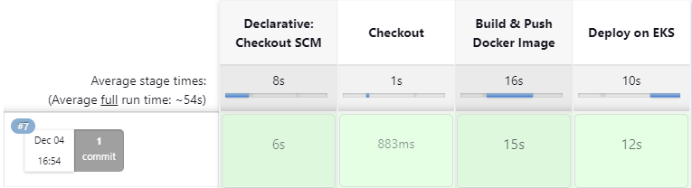

# Jenkinsfile

It contains 3 stages:


## 1 - Checkout:
This stage involves checking out the source code from the version control system using the checkout scm command. 
```
  stage('Checkout') {
            steps {
                checkout scm
            }
        }

```


## 2 - Build & Push Docker Image:

This stage is dedicated to building and pushing a Docker image using the ***Kainko*** container. Utilizing Kainko eliminates the need for setting up a Docker daemon, streamlining the process.
```
    stage('Build & Push Docker Image') {
        steps {
            container(name: 'kaniko', shell: '/busybox/sh'){
                sh '''
                    /kaniko/executor --dockerfile `pwd`/Dockerfile --context `pwd` --destination=omarsater/private-repo:python-${commitHash}
                '''
            }
        }
    }
```
> ***Kainko*** operates as a transient Jenkins pod, executing a single job to build and push a Docker image to a private repository. The pod gracefully terminates upon task completion. For more Info [here](https://faun.pub/jenkins-on-kubernetes-moving-from-docker-in-docker-to-kaniko-b48d1a240349
)

# 3 - Deploy on EKS:

This stage is responsible for Deploying our app manifest on AWS EKS using container ***kubectl***, and it contains:
- KUBECONFIGFILE Credentials: Utilize the /kube/config file containing essential information to enable the kubectl container to connect to your cluster.
- Install required packages for downloading AWS-CLI.
- Update the image tag within the app-deployment.yaml file to include the commit hash from the built image.
- Deploy the application manifest.

```
  stage('Deploy on EKS') {
              steps {
                  container (name:'kubectl', shell: '/bin/sh' ) {
                      withKubeConfig([credentialsId: 'KUBECONFIGFILE']) {
                      sh '''
                          # Install curl and unzip packages
                          apt update && apt install curl -y && apt install unzip -y &&
                      
                          # Install aws-cli v2 using curl
                          curl "https://awscli.amazonaws.com/awscli-exe-linux-x86_64.zip" -o "awscliv2.zip" &&
                          unzip awscliv2.zip &&
                           ./aws/install &&
                          
                          # Modify app-deployment.yaml file with the image tag.
                          sed -i 's/python-v1.1/python-${commitHash}/' ${WORKSPACE}/k8s/app/app-deployment.yaml &&
  
                          # Deploy app
                          kubectl apply -f ${WORKSPACE}/k8s/app/app-ns.yaml &&  
                          kubectl apply -f ${WORKSPACE}/k8s/app/app-secret.yaml &&  
                          kubectl apply -f ${WORKSPACE}/k8s/app/app-sc.yaml &&  
                          kubectl apply -f ${WORKSPACE}/k8s/app/app-pvc.yaml &&  
                          kubectl apply -f ${WORKSPACE}/k8s/app/app-deployment.yaml &&  
                          kubectl apply -f ${WORKSPACE}/k8s/app/app-svc.yaml   
                      '''
                      }
                  }
              }
          }
```

